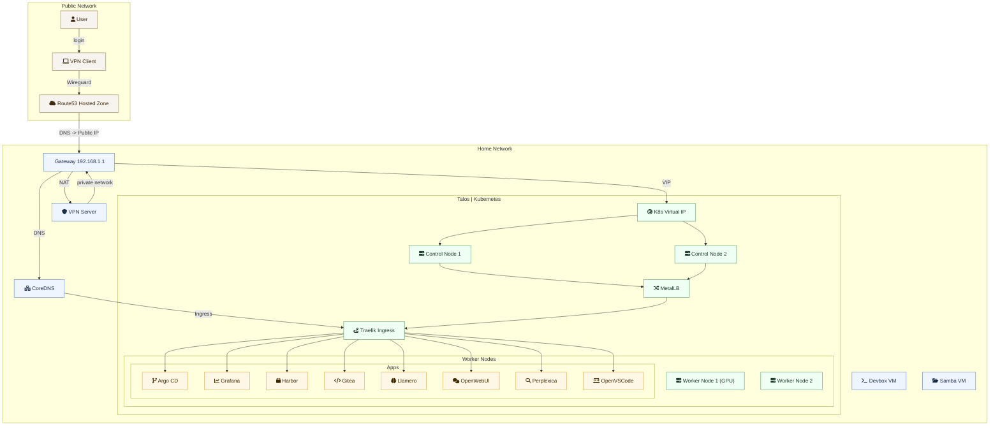

# homelab

This repository contains the complete Terraform configuration for bootstrapping
my homelab environment. It automates every step—from provisioning Proxmox VMs
and bootstrapping a Talos-based Kubernetes cluster to deploying Kubernetes
applications using Infrastructure-as-Code (IaC) principles and configuring them.

## Overview

The homelab setup is organized into two main layers:

- **Infrastructure (`infra`):**
  This layer uses Terraform modules to provision Proxmox VMs, set up a [Talos Linux](https://www.talos.dev/) based Kubernetes cluster, and configure essential networking. Key components include:
  - **VM Provisioning:**
    Ubuntu Server images are used for utility VMs (e.g., DNS/VPN), Talos images for cluster nodes, and optional Arch-based images for Devbox. CloudInit templates perform initial configuration tasks (e.g., installing necessary agents like the qemu-guest-agent, installing and configuring applications).
  - **Kubernetes Cluster Bootstrap:**
    Talos VMs are used to establish both control and worker nodes. A kube VIP ensures high availability of the Kubernetes API, while MetalLB allocates a dedicated IP for load balancing.
  - **Networking & DNS:**
    A designated CIDR range is used to automatically assign IP addresses for the DNS and VPN servers, the kube VIP, MetalLB, and Talos nodes.
  - **DNS & Certificate Management:**
    - **CoreDNS** is deployed as the local DNS server. It mirrors AWS Route53 records to support automatic certificate challenges via cert-manager.
    - **Cert-manager** obtains certificates through ACME (using Route53 for DNS challenges) to secure the cluster.
    - **Traefik** is deployed as the ingress controller on Kubernetes, routing wildcard DNS queries to the appropriate services.
  - **Storage:**
    **Longhorn** is used for persistent storage, enabling dynamic provisioning and volume management across the cluster.
  - **AWS Integration:**
    AWS is used in two key areas:
    - **Terraform Backend:**
      An AWS S3 bucket securely stores Terraform state files.
    - **Route53 for DNS:**
      Cert-manager leverages AWS Route53 (along with provided IAM credentials) to perform DNS challenges and update DNS records automatically.

- **Kubernetes Applications (`apps`):**
  Once the cluster is bootstrapped, configurations in the `apps` folder deploy various Kubernetes applications (e.g., authentik, argocd, gitea, grafana, harbor, openwebui, llamero, perplexica, openvscode, and prometheus) into the cluster.

## Topology



_The router is configured to route all DNS traffic to the dedicated DNS server and forward VPN traffic to the VPN node._

- **VM Provisioning & Cluster Bootstrapping:**
  Terraform provisions VMs for:
  - **DNS Server:** Runs CoreDNS.
  - **VPN Server:** Provides secure remote access.
  - **Kubernetes Cluster Nodes:**
    - **Talos Control Nodes:** Equipped with a kube VIP for high availability of the Kubernetes API.
    - **Talos Worker Nodes:** Automatically assigned IP addresses from a specified CIDR range.
- **Ingress & Storage:**
  - **Traefik** manages inbound traffic by routing wildcard DNS domains to services deployed on Kubernetes.
  - **Longhorn** provides the storage backend for the cluster.

## Taskfile Workflow

This project leverages [Taskfile](https://github.com/go-task/task) to streamline _Terraform_ workflows. Each layer includes its own Taskfile, while a root Taskfile is also available to coordinate commands across both layers.

### Available Tasks

#### Infrastructure

- **infra:apply:** Create or update infrastructure
- **infra:destroy:** Create or update infrastructure
- **infra:format:** Reformat your configuration in the standard style
- **infra:init:** Prepare your working directory for other commands
- **infra:kubeconfig:** Generate 'kubeconfig'
- **infra:kubeseal:** Generate kubeseal cerificate
- **infra:plan:** Show changes required by the current configuration
- **infra:ssh:** Generate SSH key and connect to specified node (vpn or dns)
- **infra:talosconfig:** Generate 'talosconfig'
- **infra:validate:** Check whether the configuration is valid
- **infra:wireguard:** Generate wireguard client configuration

#### Applications

- **apps:apply:** Create or update infrastructure
- **apps:destroy:** Create or update infrastructure
- **apps:format:** Reformat your configuration in the standard style
- **apps:init:** Prepare your working directory for other commands
- **apps:plan:** Show changes required by the current configuration
- **apps:scale-runners:** Scale Gitea action runners to the specified count (0-10)
- **apps:secrets:** Show bootstrap/admin credentials for a specified app
- **apps:setup-runners:** Run setup script on gitea runners
- **apps:validate:** Check whether the configuration is valid

## AWS Integration

This homelab configuration integrates with AWS for two key purposes:

- **Terraform Backend:**
  An AWS S3 bucket is used to securely store Terraform state files. Configure your AWS S3 backend settings in your Terraform configuration or via environment variables.
- **Route53 for DNS:**
  Cert-manager leverages AWS Route53 to perform DNS challenges and update DNS records automatically. Ensure you provide the necessary AWS IAM credentials and the Route53 hosted zone ID in your configuration.

## Getting Started

1. **Clone the Repository:**

   ```sh
   git clone https://github.com/yourusername/homelab.git
   cd homelab
   ```

2. Create a .env file (or configure variables directly) with the required parameters:

```
PROXMOX_VE_USERNAME="root@pam"
PROXMOX_VE_PASSWORD=""
```

3. Install `terraform` or `tofu` (please configure `TF` variable in `Taskfile.yaml` accordingly)
4. Setup `terraform` environment:

```
task infra:init
task apps:init
```

5. Deploy:

```
task infra:apply
task infra:kubeconfig symlink=true
task apps:apply

```
